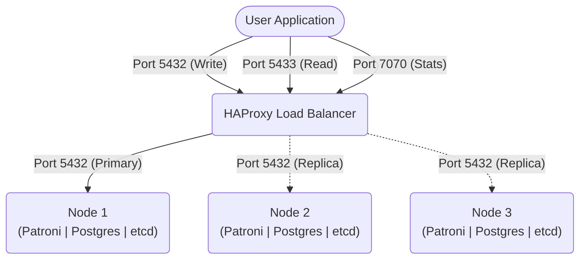

# PostgreSQL High-Availability Cluster

A containerized 3-node PostgreSQL 17 cluster configured for high availability. It uses etcd3 for distributed consensus, Patroni for automated failover and leader election, and HAProxy for read/write query routing.

## Architecture Overview



- **Automated Failover**: Patroni leverages a 3-node etcd cluster to maintain consensus. If the primary node fails, a healthy replica is automatically promoted.
- **Traffic Routing**: HAProxy handles inbound connections and routes them based on node roles:
  - **Port 5432 (Write)**: Routes traffic strictly to the active primary node.
  - **Port 5433 (Read)**: Load-balances queries across available standby replicas.
  - **Port 7070 (Dashboard)**: Provides a real-time web UI showing cluster health and routing status.
- **Data Resilience**: Configured with `use_pg_rewind` so that a former primary can quickly resynchronize and rejoin the cluster as a replica without needing a full data clone.

## Setup Instructions

### Configuration
Create your environment file from the provided template:
```bash
cp .env.example .env
```
Feel free to modify `.env` to change credentials, ports, or performance tunings.

### Deployment
Start the cluster using the deployment script, which handles pre-flight checks and waits for initial quorum:
```bash
./deploy.sh
```

## Usage

### Checking Health Status
View current node roles, state, and replication lag:
```bash
./scripts/cluster-status.sh
```

### Database Connections
Connect to the cluster using `psql` (or your preferred client) via the routed ports:

**Primary (Read-Write):**
```bash
psql -h 127.0.0.1 -p 5432 -U postgres -d postgres
```

**Replicas (Read-Only):**
```bash
psql -h 127.0.0.1 -p 5433 -U postgres -d postgres
```

### Maintenance and Switchover

To gracefully switch leadership to a different node (e.g., for maintenance):
```bash
docker compose exec -it pg1 patronictl -c /etc/patroni/patroni.yml switchover
```

To pause automated failovers, preventing unwanted elections during manual interventions:
```bash
docker compose exec -it pg1 patronictl -c /etc/patroni/patroni.yml pause
```

To resume automated failovers when finished:
```bash
docker compose exec -it pg1 patronictl -c /etc/patroni/patroni.yml resume
```

### Teardown
Stop all services and containers while preserving your database volumes:
```bash
./teardown.sh
```

To completely remove the cluster and permanently delete all persistent data volumes:
```bash
./teardown.sh -v
```
